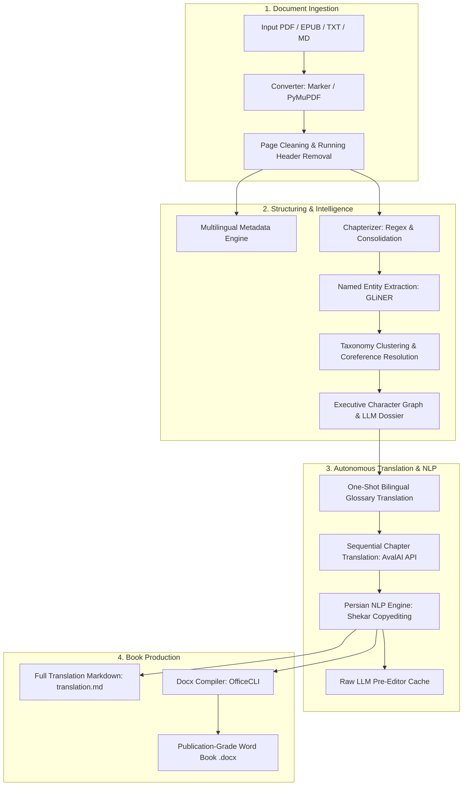

# Tome System Architecture

This document provides a comprehensive architectural breakdown of Tome, detailing its module boundaries, pipeline stages, data flow, and design patterns.

---

## 1. Architectural Layers & Module Clusters

Tome is designed around clear separation of concerns, ensuring high cohesion and low coupling across modules:

### 1.1 Interface Layer (`tome.cli` & `tome.api`)
- **CLI (`tome.cli.main`)**: Built with `argparse`, providing concise commands (`run`, `convert`, `chapterize`, `translate`, `graph`, `docx`, `edit`, `ingest`, `genre`) with short flag aliases (e.g. `-lm`, `-np`, `-ef`, `-wf`).
- **Interactive TUI (`tome.cli.tui`)**: Built with Textual, featuring reactive logs, configuration forms, model dropdowns (`Select`), and real-time process monitoring.
- **REST API (`tome.api.routes`)**: FastAPI application providing endpoints for programmatic headless execution, webhooks, and third-party orchestration.

### 1.2 Core Pipeline & Orchestration (`tome.core.pipeline`)
- **`run_pipeline()`**: Coordinates end-to-end execution from raw manuscript to finalized Word document.
- **Progress Tracking & Observers**: Event-driven callback mechanism emitting progress, token chunks, reasoning tokens, and timing diagnostics to CLI, TUI, and logs.

### 1.3 Linguistic & Extraction Engine (`tome.core`)
- **`converter.py`**: Heuristic-based routing choosing between Marker (deep layout analysis) and PyMuPDF (fast text extraction).
- **`cleaner.py`**: Cleans running headers, footers, ISBN stamps, and page numbers across 6 languages.
- **`metadata.py`**: Extracts title, author, publication year (Solar Hijri & Gregorian), publisher, and ISBN.
- **`chapterizer.py`**: Identifies chapter headings and consolidates short fragments.
- **`extractor.py`**: Runs GLiNER zero-shot NER with dynamic sliding windows and word boundaries.
- **`glossary.py`**: Performs entity clustering, coreference resolution, and Markdown table serialization.
- **`graph.py`**: Computes chapter co-occurrences and interaction snippets to produce an **Executive Character & Relationship Dossier** for LLM context.
- **`translator.py`**: Interfaces with AvalAI OpenAI-compatible endpoints with SSE streaming, reasoning capture, client request ID tracking, and safe parameter fallbacks.
- **`editor.py`**: Executes 3-layer Persian computational linguistics (Shekar normalization, half-spaces, punctuation, quote guillemets, emoji removal).

### 1.4 Compilation Engine (`tome.core.docx`)
- Wraps **OfficeCLI** to compile Markdown chapters into professional Word (`.docx`) books with standard book margins (2.5cm), justified alignment, running headers with title, dynamic page numbers, custom Eastern/Western typography, and OpenXML metadata injection.
- Seamlessly converts the compiled DOCX into a publication-ready PDF using headless LibreOffice.

---

## 2. End-to-End Manuscript Lifecycle

1. **Ingestion & Sanitization**: Raw PDFs are converted to Markdown, stripped of page artifacts and running headers.
2. **Metadata & Entity Discovery**: Detects book metadata and extracts named entities across genre-specific categories.
3. **Graph Intelligence Generation**: Generates `graph.md` containing character profiles, relationship strengths, and interaction quotes.
4. **Bilingual Glossary Completion**: Translates unique worldbuilding terms and character names in a single batch call.
5. **Chapter Translation**: Sequentially translates chapters with `{graph}` context injected into system instructions.
6. **Linguistic Copyediting**: Persian text is normalized with zero-width non-joiners (`\u200c`), guillemets (`« »`), and dialogue dashes.
7. **Production Assembly**: Assembles `translation.md` and compiles the final `.docx` book with automated typography.
